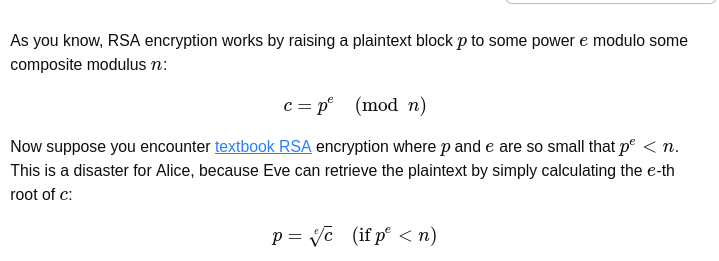

# RSA_ORACLE

Can you abuse the oracle?An attacker was able to intercept communications between a bank and a fintech company. They managed to get the [message](https://artifacts.picoctf.net/c_titan/148/secret.enc) (ciphertext) and the [password](https://artifacts.picoctf.net/c_titan/148/password.enc) that was used to encrypt the message.After some intensive reconassainance they found out that the bank has an oracle that was used to encrypt the password and can be found here `nc titan.picoctf.net 62713`. Decrypt the password and use it to decrypt the message. The oracle can decrypt anything except the password.

## Solution:-


From the given hints I was able to understand that I need to somehow find a way put the value of password.enc into the given machine to decrypt it and get the password. After getting the password I need to put in the openssl command and that will produce the flag for me. 

I first read how the RSA encryption works. After understanding the basics of the encryption I researched a bit about what a plaintext attack on RSA is. So I understood that if I multiply the cipher text of the password with an integer like 2 and then convert the result into decimal string format and divide I can get back the original password and pass that into the openssl command. 

```python
from pwn import *


connection = remote("titan.picoctf.net", 62713) 
connection.recvuntil(b"decrypt.")
with open("password.enc") as file:
c = int(file.read())


connection.sendline(b"E")
connection.recvuntil(b"keysize): ")
connection.sendline(b"\x02")
connection.recvuntil(b"mod n) ")
  
c_a = int(connection.recvline())

print("password.enc is:")
print(c)
print("2 is:")
print(c_a)
print("2*hex is:")
print(c_a * c)

connection.sendline(b"D")
connection.recvuntil(b"decrypt: ")
connection.sendline(str(c_a * c).encode())
connection.recvuntil(b"mod n): ")
password = int(connection.recvline(), 16) // 2
print(password)

password = password.to_bytes(len(str(password)) - 7, "big").decode("utf-8")
print("Password:", password)
```

Output of this code was:-

```
password.enc is:
2575135950983117315234568522857995277662113128076071837763492069763989760018604733813265929772245292223046288098298720343542517375538185662305577375746934
2 is:
5067313465613043651275429665315895824157755779222372979446076012356324498190828210335763979330272318657269048435311897896433721115606764442199497891219230
215627228002
Password: 24bcb
[*] Closed connection to titan.picoctf.net port 54841
abhiraj@fedora:~/Programs/String_C_Programming$ python3 excel.py
[+] Opening connection to titan.picoctf.net on port 54841: Done
password.enc is:
2575135950983117315234568522857995277662113128076071837763492069763989760018604733813265929772245292223046288098298720343542517375538185662305577375746934
2 is:
5067313465613043651275429665315895824157755779222372979446076012356324498190828210335763979330272318657269048435311897896433721115606764442199497891219230
2*hex is:
13049021080201001105084094820758408678411016591417791344739809668417368031416672225959975893049032113743362967724459860585607152388547220806865642388521893280614527786999218748525925092100118435303251176389487115803412426876586505623465372778359444868830586246810436452425391376029960068466907610801194340820
215627228002
Password: 24bcb
[*] Closed connection to titan.picoctf.net port 54841
abhiraj@fedora:~/Programs/String_C_Programming$ 
 *  History restored 

abhiraj@fedora:~/Programs/String_C_Programming$ python3 excel.py 
[+] Opening connection to titan.picoctf.net on port 54841: Done
password.enc is:
2575135950983117315234568522857995277662113128076071837763492069763989760018604733813265929772245292223046288098298720343542517375538185662305577375746934
2 is:
5067313465613043651275429665315895824157755779222372979446076012356324498190828210335763979330272318657269048435311897896433721115606764442199497891219230
2*hex is:
13049021080201001105084094820758408678411016591417791344739809668417368031416672225959975893049032113743362967724459860585607152388547220806865642388521893280614527786999218748525925092100118435303251176389487115803412426876586505623465372778359444868830586246810436452425391376029960068466907610801194340820
215627228002
Password: 24bcb
[*] Closed connection to titan.picoctf.net port 54841
```

This below code is doing everything mentioned above but using connection library to do so. Initially I wasted a lot of time trying to manually enter 2 in the `nc titan.picoctf.net 62713` console.  As in console 2 would get converted into '2' instead of integer 2

Then put the password in the openssl command

```bash
openssl enc -aes-256-cbc -d -in secret.enc
```

This gave the output as the flag:-
```
enter AES-256-CBC decryption password:
*** WARNING : deprecated key derivation used.
Using -iter or -pbkdf2 would be better.
picoCTF{su((3ss_(r@ck1ng_r3@_24bcbc66}
```

## Flag


picoCTF{su((3ss_(r@ck1ng_r3@_24bcbc66}


## Resources
https://crypto.stackexchange.com/questions/2323/how-does-a-chosen-plaintext-attack-on-rsa-work/2331#2331

# Custom Encryption


Can you get sense of this code file and write the function that will decode the given encrypted file content.Find the encrypted file here [flag_info](https://artifacts.picoctf.net/c_titan/18/enc_flag) and [code file](https://artifacts.picoctf.net/c_titan/18/custom_encryption.py) might be good to analyze and get the flag.


## Solution

In this we were provided a code file and then also provided information of a variable and b variable along with the cipher. In this question I basically just looked at the encryption function and to make the decryption function just did the same thing but opposite. I also learnt a concept about XOR that if `a = b^c` then `b = a^c`

Below is the final code after I did changes to code file provided. 

```python
from random import randint
import sys


def generator(g, x, p):
    return pow(g, x) % p


def encrypt(plaintext, key):
    cipher = []
    for char in plaintext:
        cipher.append(((ord(char) * key * 311)))
    return cipher


def decrypt(cipher, key):
    text = ""
    for x in cipher:
        c = x // (key * 311)
        text += chr(c)
    return text


def is_prime(p):
    v = 0
    for i in range(2, p + 1):
        if p % i == 0:
            v = v + 1
    if v > 1:
        return False
    else:
        return True


def dynamic_xor_encrypt(plaintext, text_key):
    cipher_text = ""
    key_length = len(text_key)
    for i, char in enumerate(plaintext[::-1]):
        key_char = text_key[i % key_length]
        encrypted_char = chr(ord(char) ^ ord(key_char))
        cipher_text += encrypted_char
    return cipher_text


def dynamic_decrypt(cipher, text_key):
    plaintext = ""
    key_length = len(text_key)
    for i, char in enumerate(cipher):
        key_char = text_key[i % key_length]
        decrypted_char = chr(ord(char) ^ ord(key_char))
        plaintext += decrypted_char
    return plaintext[::-1]


def test(plain_text, text_key):
    p = 97
    g = 31
    if not is_prime(p) and not is_prime(g):
        print("Enter prime numbers")
        return
    a = 94
    b = 29
    print(f"a = {a}")
    print(f"b = {b}")
    u = generator(g, a, p)
    v = generator(g, b, p)
    key = generator(v, a, p)
    b_key = generator(u, b, p)
    shared_key = None
    if key == b_key:
        shared_key = key
    else:
        print("Invalid key")
        return
    # semi_cipher = dynamic_xor_encrypt(plain_text, text_key)
    # cipher = encrypt(semi_cipher, shared_key)
    cipher = [
        260307,
        491691,
        491691,
        2487378,
        2516301,
        0,
        1966764,
        1879995,
        1995687,
        1214766,
        0,
        2400609,
        607383,
        144615,
        1966764,
        0,
        636306,
        2487378,
        28923,
        1793226,
        694152,
        780921,
        173538,
        173538,
        491691,
        173538,
        751998,
        1475073,
        925536,
        1417227,
        751998,
        202461,
        347076,
        491691,
    ]

    z = decrypt(cipher, shared_key)
    k = dynamic_decrypt(z, text_key)
    # if z == semi_cipher:
    #     print("the same:")
    # if k == plain_text:
    #     print("The same again:")
    #     print(f"The plain text {k}")
    print(f"cipher is: {cipher}")
    print(k)


if __name__ == "__main__":
    # message = sys.a
    # rgv[0]
    test("hello fraud", "trudeau")

```


My biggest stumbling block on this question was the fact that I forgot that the encryptionXor function was reversing the string. Hence after fixing that the code started working. 

Output of the above code.
```
a = 94
b = 29
cipher is: [260307, 491691, 491691, 2487378, 2516301, 0, 1966764, 1879995, 1995687, 1214766, 0, 2400609, 607383, 144615, 1966764, 0, 636306, 2487378, 28923, 1793226, 694152, 780921, 173538, 173538, 491691, 173538, 751998, 1475073, 925536, 1417227, 751998, 202461, 347076, 491691]
picoCTF{custom_d2cr0pt6d_751a22dc}
```


## Flag

picoCTF{custom_d2cr0pt6d_751a22dc}


# miniRSA

Let's decrypt this: [ciphertext](https://jupiter.challenges.picoctf.org/static/eb5e6df8e14c52873cf88c582a1a4008/ciphertext)? Something seems a bit small.

## Solution

In this question we were provided a very small value of e and a very large value of n. The value of n was too large to use any normal formulae of trying to find encrypted text. Instead I searched online and found this text about how if the e value is very small and the n value is very large I can use the following formula




So I implement the following in python
```python
import gmpy2

e = 3
c = 2205316413931134031074603746928247799030155221252519872650080519263755075355825243327515211479747536697517688468095325517209911688684309894900992899707504087647575997847717180766377832435022794675332132906451858990782325436498952049751141


m, exact = gmpy2.iroot(c, e)

if not exact:
    raise ValueError(
        "Ciphertext is not a perfect cube — modular reduction may have occurred."
    )

pt = int(m).to_bytes((m.bit_length() + 7) // 8, "big").decode(errors="ignore")
print("Plaintext:", pt)

```

The output of this code was the flag.

## Flag

picoCTF{n33d_a_lArg3r_e_d0cd6eae}

## Resources 
https://crypto.stackexchange.com/questions/33561/cube-root-attack-rsa-with-low-exponent