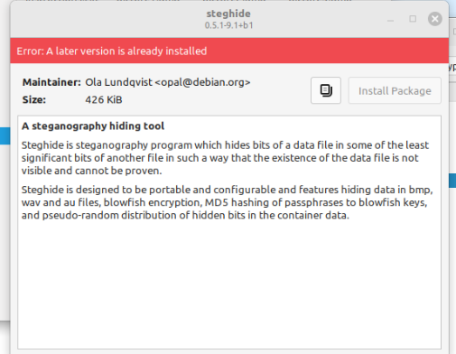
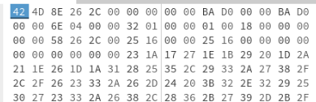
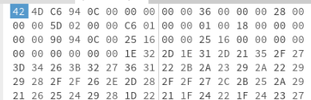
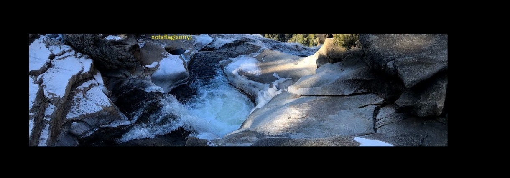
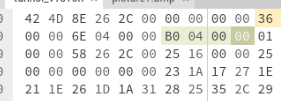
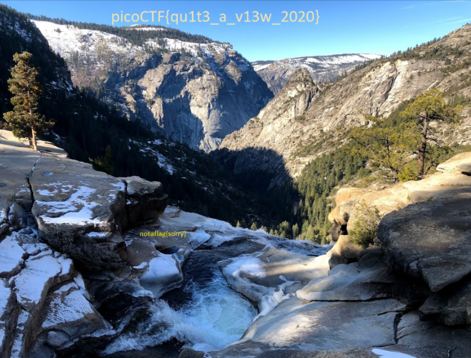
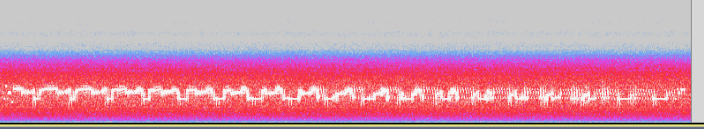
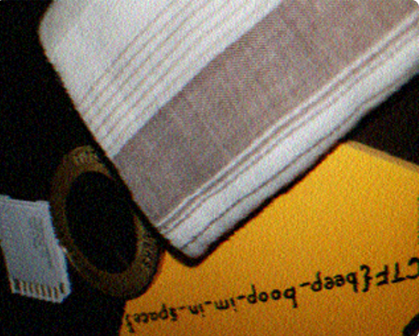

# Trivial Flag Transfer Protocol

Figure out how they moved the [flag](https://mercury.picoctf.net/static/e4836d9bcc740d457f4331d68129a0bc/tftp.pcapng).

## Solution:-

I first loaded the pcapng file into Wireshark.

From that I was able to notice that there are some files in it which all share the same protocol of TFTP. So I went to export all of the objects of that protocol.


Above is all the files I got for exporting the pcapng file. 

I ran instructions.txt through rot 13 decoder along with plan to get the following two outputs 

```
TFTPDOESNTENCRYPTOURTRAFFICSOWEMUSTDISGUISEOURFLAGTRANSFER.FIGUREOUTAWAYTOHIDETHEFLAGANDIWILLCHECKBACKFORTHEPLAN
```

```
IUSEDTHEPROGRAMANDHIDITWITH-DUEDILIGENCE.CHECKOUTTHEPHOTOS
```

Basically from these two texts I was able to infer that they hid it using program.deb since that is program given.

On opening the program.deb this is what i get



From this I am able to understand that they have hidden something in the photos using steghide. Now we just need to use the same Steganography tool to open up what is in the photo.

```bash
steghide extract -sf picture1.bmp -p DUEDILIGENCE
steghide extract -sf picture2.bmp -p DUEDILIGENCE
steghide extract -sf picture3.bmp -p DUEDILIGENCE
```

The first two pictures didn't contain anything but the third one contained a exported the flag to `flag.txt`

## Flag

picoCTF{h1dd3n_1n_pLa1n_51GHT_18375919}

## Conceps Learned

PCapng files are defined as packet capture (new gen) files.
How to export files in a pcap files using wireshark.
steganography is a tool that is used to hide information in pictures with help of a passphrase 


# Tunn3l v1s10n

We found this [file](https://mercury.picoctf.net/static/06a5e4ab22ba52cd66a038d51a6cc07b/tunn3l_v1s10n). Recover the flag.

## Solution

After downloading the file I was able to understood that it was an image file so I ran the exiftool on the file

```bash
exiftool tunn3l_v1s10n
```

The output of the above code was 
```bash
ExifTool Version Number         : 12.40
File Name                       : tunn3l_v1s10n
Directory                       : .
File Size                       : 2.8 MiB
File Modification Date/Time     : 2025:10:27 15:49:43+05:30
File Access Date/Time           : 2025:10:28 16:50:08+05:30
File Inode Change Date/Time     : 2025:10:27 15:50:43+05:30
File Permissions                : -rw-r--r--
File Type                       : BMP
File Type Extension             : bmp
MIME Type                       : image/bmp
BMP Version                     : Unknown (53434)
Image Width                     : 1134
Image Height                    : 306
Planes                          : 1
Bit Depth                       : 24
Compression                     : None
Image Length                    : 2893400
Pixels Per Meter X              : 5669
Pixels Per Meter Y              : 5669
Num Colors                      : Use BitDepth
Num Important Colors            : All
Red Mask                        : 0x27171a23
Green Mask                      : 0x20291b1e
Blue Mask                       : 0x1e212a1d
Alpha Mask                      : 0x311a1d26
Color Space                     : Unknown (,5%()
Rendering Intent                : Unknown (826103054)
Image Size                      : 1134x306
Megapixels                      : 0.347
```

From the output I am able to see that it was a BMP image file but there was some error that was not allowing it to open. 

After some time due to not understanding anything I opened the the picture1.bmp file from the previous question to analyse the difference. 

```bash
exiftool ~/Downloads/picture1.bmp
```

```bash
ExifTool Version Number         : 12.40
File Name                       : picture1.bmp
Directory                       : /home/gunda/Downloads
File Size                       : 805 KiB
File Modification Date/Time     : 2025:10:27 15:56:17+05:30
File Access Date/Time           : 2025:10:27 15:56:22+05:30
File Inode Change Date/Time     : 2025:10:27 15:56:17+05:30
File Permissions                : -rw-r--r--
File Type                       : BMP
File Type Extension             : bmp
MIME Type                       : image/bmp
BMP Version                     : Windows V3
Image Width                     : 605
Image Height                    : 454
Planes                          : 1
Bit Depth                       : 24
Compression                     : None
Image Length                    : 824464
Pixels Per Meter X              : 5669
Pixels Per Meter Y              : 5669
Num Colors                      : Use BitDepth
Num Important Colors            : All
Image Size                      : 605x454
Megapixels                      : 0.275
```


We can clearly see the difference between the two outputs is that the picture which opens has a BMP version that is defined. This file doesn't have a BMP version defined. So after a bit of research I opened the file in hexedit this is the output I get




I compared this with picture1.bmp



I converted the BAD0 in original photo to the values in picutre1.bmp and then checked the output i get. 



After some hints I realized that I needed to increase the height of the given image and to do that I needed to increase the height for that I researched for some  time and found out that from the 16th byte for the next 4 bytes hold the value of the height. 

I converted 1200 to little endian format and put it over there



After that the output of the photo  is:-



## Flag:-
picoCTF{qu1t3_a_v13w_2020}

## Resources:-
https://www.rapidtables.com/convert/number/decimal-to-hex.html
https://www.donwalizerjr.com/understanding-bmp/

# m00nwalk

Decode this [message](https://jupiter.challenges.picoctf.org/static/d6fcea5e3c6433680ea4f914e24fab61/message.wav) from the moon.

## Solution

In this question we are given a message.wav file in the question. 
First I loaded this into audacity and tried to do spectography analysis. 



From this I didn't get any help so i just duckduckgoed the clue that was given and found out that the message was sent back using SSTV.

I just found an online SSTV decoder and decoded the message. 

This was the output




## Flag

picoCTF{beep_boop_im_in_space}

## Resources:-

https://sstv-decoder.mathieurenaud.fr/
