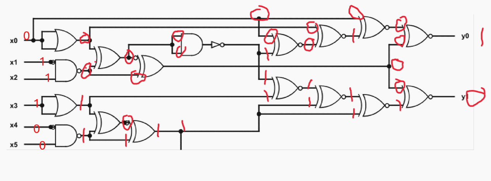
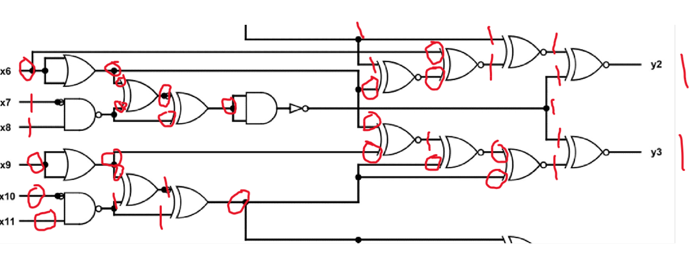
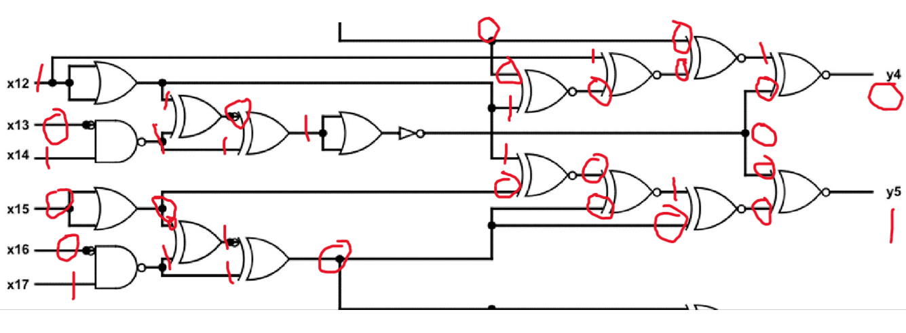
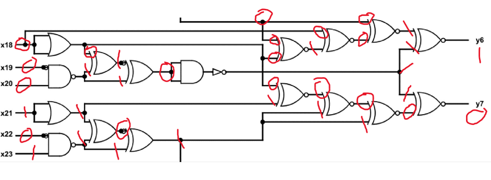
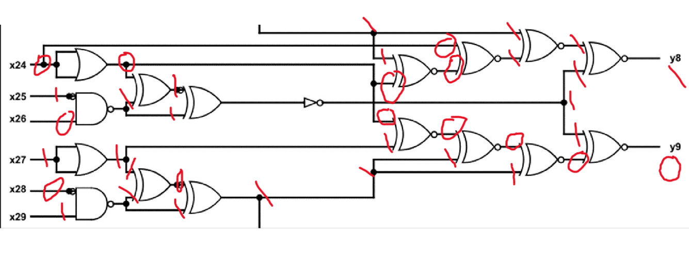
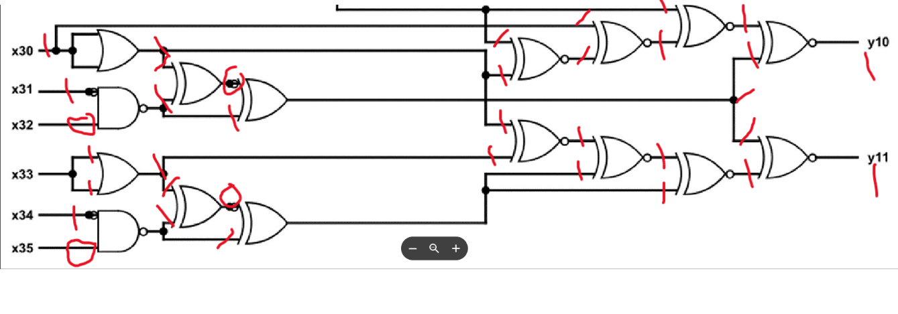

# iqtest

## Solution 

This challenge was just time consuming just had to learn what the different symbols mean and after that just solve them but by dividing the 36 bits in 6 groups of 6 bits of x

## Flag

nite{101101101011}

