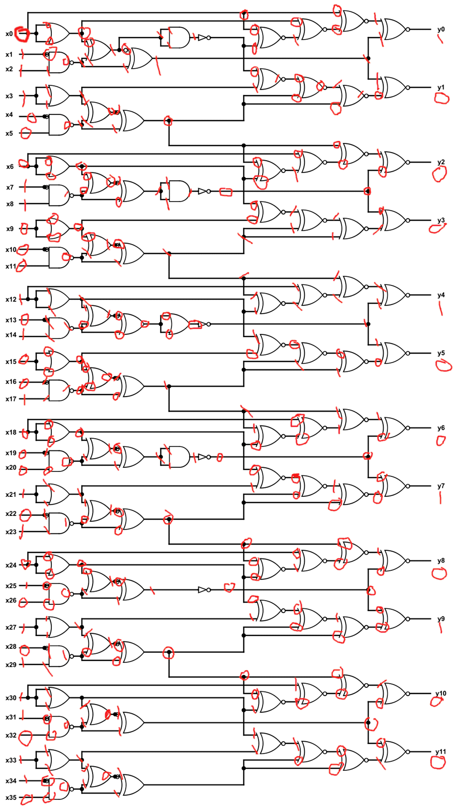
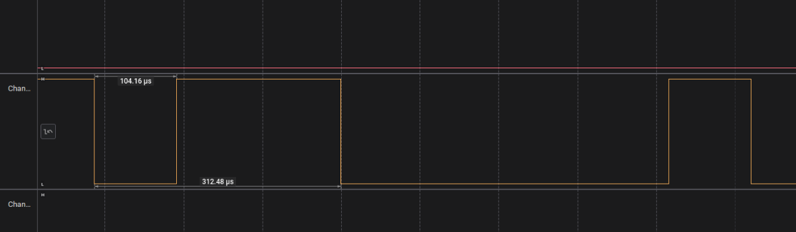
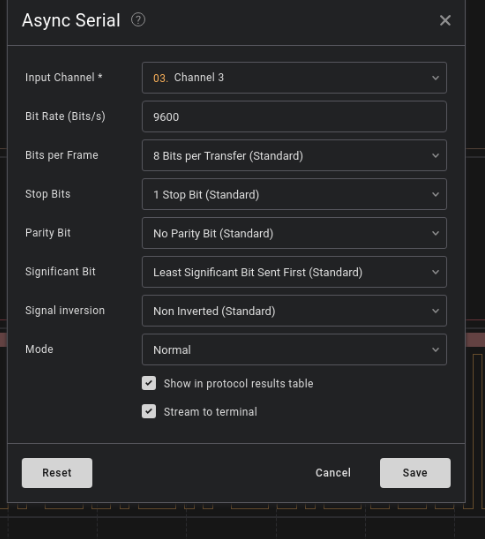
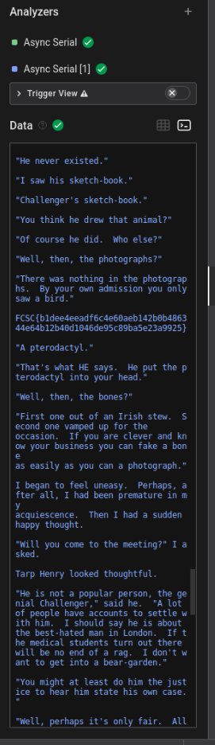

# iqtest


## Solution 

This challenge was just time consuming just had to learn what the different symbols mean and after that just solve them 





## Flag

nite{100010010100}


# Bare Metal Alchemist

my friend recommended me this anime but i think i've heard a wrong name.

## Solution

I took the firmware.elf file and ran it through ghidra and after that checked out the main function and this is what I got. 

```c

void main(void)

{
  char cVar1;
  byte bVar2;
  char cVar3;
  undefined2 uStack_5;
  undefined2 uStack_3;
  undefined1 uStack_1;
  
  R1 = 0;
  uStack_1 = Y._1_1_;
  uStack_3 = 0xbe;
  Y = CONCAT11((char)((uint)((int)&uStack_5 + 1) >> 8),(char)&uStack_5 + '\x01');
  R25R24._0_1_ = DAT_mem_0044;
  R25R24._0_1_ = (byte)R25R24 | 2;
  DAT_mem_0044 = (byte)R25R24;
  R25R24._0_1_ = DAT_mem_0044;
  R25R24._0_1_ = (byte)R25R24 | 1;
  DAT_mem_0044 = (byte)R25R24;
  R25R24._0_1_ = DAT_mem_0045;
  R25R24._0_1_ = (byte)R25R24 | 2;
  DAT_mem_0045 = (byte)R25R24;
  R25R24._0_1_ = DAT_mem_0045;
  R25R24._0_1_ = (byte)R25R24 | 1;
  DAT_mem_0045 = (byte)R25R24;
  R25R24._0_1_ = DAT_mem_006e;
  R25R24._0_1_ = (byte)R25R24 | 1;
  DAT_mem_006e = (byte)R25R24;
  DAT_mem_0081 = 0;
  R25R24._0_1_ = DAT_mem_0081;
  R25R24._0_1_ = (byte)R25R24 | 2;
  DAT_mem_0081 = (byte)R25R24;
  R25R24._0_1_ = DAT_mem_0081;
  R25R24._0_1_ = (byte)R25R24 | 1;
  DAT_mem_0081 = (byte)R25R24;
  R25R24._0_1_ = DAT_mem_0080;
  R25R24._0_1_ = (byte)R25R24 | 1;
  DAT_mem_0080 = (byte)R25R24;
  R25R24._0_1_ = DAT_mem_00b1;
  R25R24._0_1_ = (byte)R25R24 | 4;
  DAT_mem_00b1 = (byte)R25R24;
  R25R24._0_1_ = DAT_mem_00b0;
  R25R24._0_1_ = (byte)R25R24 | 1;
  DAT_mem_00b0 = (byte)R25R24;
  R25R24._0_1_ = DAT_mem_007a;
  R25R24._0_1_ = (byte)R25R24 | 4;
  DAT_mem_007a = (byte)R25R24;
  R25R24._0_1_ = DAT_mem_007a;
  R25R24._0_1_ = (byte)R25R24 | 2;
  DAT_mem_007a = (byte)R25R24;
  R25R24._0_1_ = DAT_mem_007a;
  R25R24._0_1_ = (byte)R25R24 | 1;
  DAT_mem_007a = (byte)R25R24;
  R25R24._0_1_ = DAT_mem_007a;
  R25R24._0_1_ = (byte)R25R24 | 0x80;
  DAT_mem_007a = (byte)R25R24;
  DAT_mem_00c1 = 0;
  R25R24._0_1_ = DAT_mem_002a;
  R25R24._0_1_ = (byte)R25R24 | 0xf8;
  DAT_mem_002a = (byte)R25R24;
  R25R24._0_1_ = DAT_mem_0024;
  R25R24._0_1_ = (byte)R25R24 | 3;
  DAT_mem_0024 = (byte)R25R24;
  bVar2 = DAT_mem_002a;
  DAT_mem_002a = bVar2 & 0xfb;
  R25R24._0_1_ = DAT_mem_002b;
  R25R24._0_1_ = (byte)R25R24 & 7;
  DAT_mem_002b = (byte)R25R24;
  R25R24._0_1_ = DAT_mem_0025;
  R25R24._0_1_ = (byte)R25R24 & 0xfc;
  DAT_mem_0025 = (byte)R25R24;
  R11 = 0xa5;
  R12 = 0;
  R13 = '\0';
  do {
    R25R24._0_1_ = DAT_mem_0029;
    R25R24._0_1_ = (byte)R25R24 ^ (byte)R25R24 * '\x02';
    if (((byte)R25R24 & 4) == 0) {
      uStack_5 = (undefined *)0x141;
      z1();
    }
    else {
      R15R14 = (byte *)0x68;
      R16 = 0;
      while( true ) {
        Z = R15R14;
        R25R24._0_1_ = *R15R14;
        if ((byte)R25R24 == 0) break;
        Z._1_1_ = (undefined1)((uint)R15R14 >> 8);
        Z._0_1_ = (byte)R25R24 ^ R11;
        if ((byte)R25R24 == 0xa5) break;
        R25R24._0_1_ = DAT_mem_0029;
        R25R24._0_1_ = (byte)R25R24 ^ (byte)R25R24 * '\x02';
        if (((byte)R25R24 & 4) == 0) {
          uStack_5 = (undefined *)0x131;
          z1();
          break;
        }
        Z._0_1_ = (byte)Z - 0x30;
        R17 = 0;
        if ((byte)Z < 0x4e) {
          Z = (byte *)CONCAT11(1,(byte)Z);
          R17 = *Z;
        }
        uStack_5 = &DAT_mem_0151;
        z1();
        if ((R17 & 1) != 0) {
          bVar2 = DAT_mem_002b;
          DAT_mem_002b = bVar2 | 8;
        }
        if ((R17 & 2) != 0) {
          bVar2 = DAT_mem_002b;
          DAT_mem_002b = bVar2 | 0x10;
        }
        if ((R17 & 4) != 0) {
          bVar2 = DAT_mem_002b;
          DAT_mem_002b = bVar2 | 0x20;
        }
        if ((R17 & 8) != 0) {
          bVar2 = DAT_mem_002b;
          DAT_mem_002b = bVar2 | 0x40;
        }
        if ((R17 & 0x10) != 0) {
          bVar2 = DAT_mem_002b;
          DAT_mem_002b = bVar2 | 0x80;
        }
        if ((R17 & 0x20) != 0) {
          bVar2 = DAT_mem_0025;
          DAT_mem_0025 = bVar2 | 1;
        }
        if ((R17 & 0x40) != 0) {
          bVar2 = DAT_mem_0025;
          DAT_mem_0025 = bVar2 | 2;
        }
        R25R24._0_1_ = R16 & 0x1f;
        cVar3 = (byte)R25R24 + 0x2d;
        while (cVar1 = cVar3 + -1, cVar3 != '\0') {
          Z = (byte *)0xf9f;
          do {
            Z = (byte *)((int)Z + -1);
            cVar3 = cVar1;
          } while (Z != (byte *)0x0);
        }
        R15R14 = (byte *)CONCAT11(R15R14._1_1_ - (((char)R15R14 != -1) + -1),(char)R15R14 + '\x01');
        R16 = R16 + 0x25;
      }
      *(byte *)(Y + 2) = R1;
      *(byte *)(Y + 1) = R1;
      while( true ) {
        R25R24._0_1_ = *(byte *)(Y + 1);
        R25R24._1_1_ = *(char *)(Y + 2);
        if (R25R24._1_1_ != '\0' && ((byte)R25R24 < 0x2c) <= (byte)(R25R24._1_1_ - 1U)) break;
        R25R24 = *(int *)(Y + 1) + 1;
        *(char *)(Y + 2) = R25R24._1_1_;
        *(byte *)(Y + 1) = (byte)R25R24;
      }
    }
    if (R12 != R1 || R13 != (byte)(R1 + (R12 < R1))) {
      uStack_5 = (undefined *)0x146;
      __vectors();
    }
  } while( true );
}


```


From the above code we can see that this is starting from the memory location 0x68 and will continue to go on till it reaches the value of 0x00

So the memory dump of this will be

```
0xF1, 0xE3, 0xE6, 0xE6, 0xF1, 0xE3, 0xDE, 0xF1, 0xCD, 0x94, 0xD6, 0xFA, 0x94, 0xD6, 0xFA, 0xD6, 0xCA, 0xC8, 0x96, 0xFA, 0xD6, 0x94, 0xC8, 0xD5, 0xC9, 0x96, 0xFA, 0x91, 0xD7, 0xC1, 0xD0, 0x94, 0xCB, 0xCA, 0xFA, 0xC3, 0x94, 0xD7, 0xC8, 0xD2, 0x91, 0xD7, 0xC0, 0xD8,0x00
```

So after this we can put these values into python code to understand what they mean.

```python
raw = [
    0xF1,
    0xE3,
    0xE6,
    0xE6,
    0xF1,
    0xE3,
    0xDE,
    0xF1,
    0xCD,
    0x94,
    0xD6,
    0xFA,
    0x94,
    0xD6,
    0xFA,
    0xD6,
    0xCA,
    0xC8,
    0x96,
    0xFA,
    0xD6,
    0x94,
    0xC8,
    0xD5,
    0xC9,
    0x96,
    0xFA,
    0x91,
    0xD7,
    0xC1,
    0xD0,
    0x94,
    0xCB,
    0xCA,
    0xFA,
    0xC3,
    0x94,
    0xD7,
    0xC8,
    0xD2,
    0x91,
    0xD7,
    0xC0,
    0xD8,
]

for x in raw:
    print(bytes([x ^ 0xA5]).decode(), end="")

```


The output of this code is the flag.

## Flag

TFCCTF{Th1s_1s_som3_s1mpl3_4rdu1no_f1rmw4re}


# I like logic

i like logic and i like files, apparently, they have something in common, what should my next step be.

## Solution

In this question we were given a .sal file. I first researched what does this file mean. I then found out that it means Saleae Logic Analyzer. It stores digital signal for data analysis. So then to open this file I used the software that was made by the company after whom these types of files were named called logic 2. I then open the .sal file with that and this is what I got. 




After doing some research I understood that I need to add an async analyzer. So after doing that 




I then analysed what data is given and this is the following photo that I get



```
on't think he makes any claims of
that kind.  But I do believe he has got something new."

"Then for Heaven's sake, man, write it up!"

"I'm longing to, but all I know he gave me in confidence and on
condition that I didn't."  I condensed into a few sentences the
Professor's narrative.  "That's how it stands."

McArdle looked deeply incredulous.

"Well, Mr. Malone," he said at last, "about this scientific meeting
to-night; there can be no privacy about that, anyhow.  I don't suppose
any paper will want to report it, for Waldron has been reported already
a dozen times, and no one is aware that Challenger will speak.  We may
get a scoop, if we are lucky.  You'll be there in any case, so you'll
just give us a pretty full report.  I'll keep space up to midnight."

My day was a busy one, and I had an early dinner at the Savage Club
with Tarp Henry, to whom I gave some account of my adventures.  He
listened with a sceptical smile on his gaunt face, and roared with
laughter on hearing that the Professor had convinced me.

"My dear chap, things don't happen like that in real life.  People
don't stumble upon enormous discoveries and then lose their evidence.
Leave that to the novelists.  The fellow is as full of tricks as the
monkey-house at the Zoo.  It's all bosh."

"But the American poet?"

"He never existed."

"I saw his sketch-book."

"Challenger's sketch-book."

"You think he drew that animal?"

"Of course he did.  Who else?"

"Well, then, the photographs?"

"There was nothing in the photographs.  By your own admission you only
saw a bird."

FCSC{b1dee4eeadf6c4e60aeb142b0b486344e64b12b40d1046de95c89ba5e23a9925}

"A pterodactyl."

"That's what HE says.  He put the pterodactyl into your head."

"Well, then, the bones?"

"First one out of an Irish stew.  Second one vamped up for the
occasion.  If you are clever and know your business you can fake a bone
as easily as you can a photograph."

I began to feel uneasy.  Perhaps, after all, I had been premature in my
acquiescence.  Then I had a sudden happy thought.

"Will you come to the meeting?" I asked.

Tarp Henry looked thoughtful.

"He is not a popular person, the genial Challenger," said he.  "A lot
of people have accounts to settle with him.  I should say he is about
the best-hated man in London.  If the medical students turn out there
will be no end of a rag.  I don't want to get into a bear-garden."

"You might at least do him the justice to hear him state his own case."

"Well, perhaps it's only fair.  All right.  I'm your man for the
evening."

When we arrived at the hall we found a much greater concourse than I
had expected.  A line of electric broughams discharged their little
cargoes of white-bearded professors, while the dark stream of humbler
pedestrians, who crowded through the arched door-way, showed that the
audience would be popular as well as scientific.  Indeed, it became
evident to us as soon as we had taken our seats that a youthful and
even boyish spirit was abroad in the gallery and the back portions of
the hall.  Looking behind me, I could see rows of faces of the familiar
medical student type.  Apparently the great hospitals had each sent
down their contingent.  The behavior of the audience at present was
good-humored, but mischievous.  Scraps of popular songs were chorused
with an enthusiasm which was a strange prelude to a scientific lecture,
and there was already a tendency to personal chaff which promised a
jovial evening to others, however embarrassing it might be to the
recipients of these dubious honors.

Thus, when old Doctor Meldrum, with his well-known curly-brimmed
opera-hat, appeared upon the platform, there was such a universal query
of "Where DID you get that tile?" that he hurriedly removed it, and
concealed it furtively under his chair.  When gouty Professor Wadley
limped down to his seat there were general affectionate inquiries from
all parts of the hall as to the exact state of his poor toe, which
caused him obvious embarrassment.  The greatest demonstration of all,
however, was at the entrance of my new acquaintance, Professor
Challenger, when he passed down to take his place at the extreme end of
the front row of the platform.  Such a yell of welcome broke forth when
his black beard first protruded round the corner that I began to
suspect Tarp Henry was right in his surmise, and that this assemblage
was there not merely for the sake of the lecture, but because it had
got rumored abroad that the famous Professor would take part in the
proceedings.

There was some sympathetic laughter on his entrance among the front
benches of well-dressed spectators, as though the demonstration of the
students in this instance was not unwelcome to them.  That greeting
was, indeed, a frightful outburst of sound, the uproar of the carnivora
cage when the step of the bucket-bearing keeper is heard in the
distance.  There was an offensive tone in it, perhaps, and yet in the
main it struck me as mere riotous outcry, the noisy reception of one
who amused and interested them, rather than of one they disliked or
despised.  Challenger smiled with weary and tolerant contempt, as a
kindly man would meet the yapping of a litter of puppies.  He sat
slowly down, blew out his chest, passed his hand caressingly down his
beard, and looked with drooping eyelids and supercilious eyes at the
crowded hall before him.  The uproar of his advent had not yet died
away when Professor Ronald Murray, the chairman, and Mr. Waldron, the
lecturer, threaded their way to the front, and the proceedings began.

Professor Murray will, I am sure, excuse me if I say that he has the
common fault of most Englishmen of being inaudible.  Why on earth
people who have something to say which is worth hearing should not take
the slight trouble to learn how to make it heard is one of the strange
mysteries of modern life.  Their methods are as reasonable as to try to
pour some precious stuff from the spring to the reservoir through a
non-conducting pipe, which could by the least effort be opened.
Professor Murray made several profound remarks to his white tie and to
the water-carafe upon the table, with a humorous, twinkling aside to
the silver candlestick upon his right.  Then he sat down, and Mr.
Waldron, the famous popular lecturer, rose amid a general murmur of
applause.  He was a stern, gaunt man, with a harsh voice, and an
aggressive manner, but he had the merit of knowing how to assimilate
the ideas of other men, and to pass them on in a way which was
intelligible and even interesting to the lay public, with a happy knack
of being funny about the most unlikely objects, so that the precession
of the Equinox or the formation of a vertebrate became a highly
humorous process as treated by him.

It was a bird's-eye view of creation, as interpreted by science, which,
in language always clear and sometimes picturesque, he unfolded before
us.  He told us of t
```

After exporting this data in a text editor this is the flag I get. 

## Flag

FCSC{b1dee4eeadf6c4e60aeb142b0b486344e64b12b40d1046de95c89ba5e23a9925}
